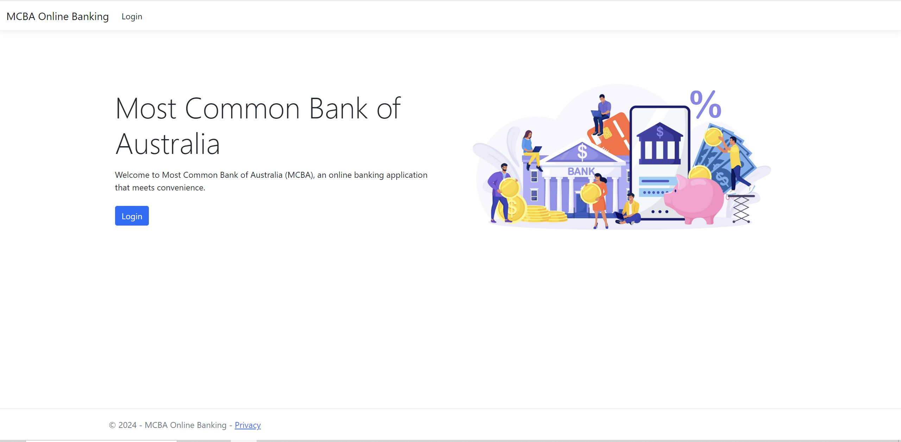
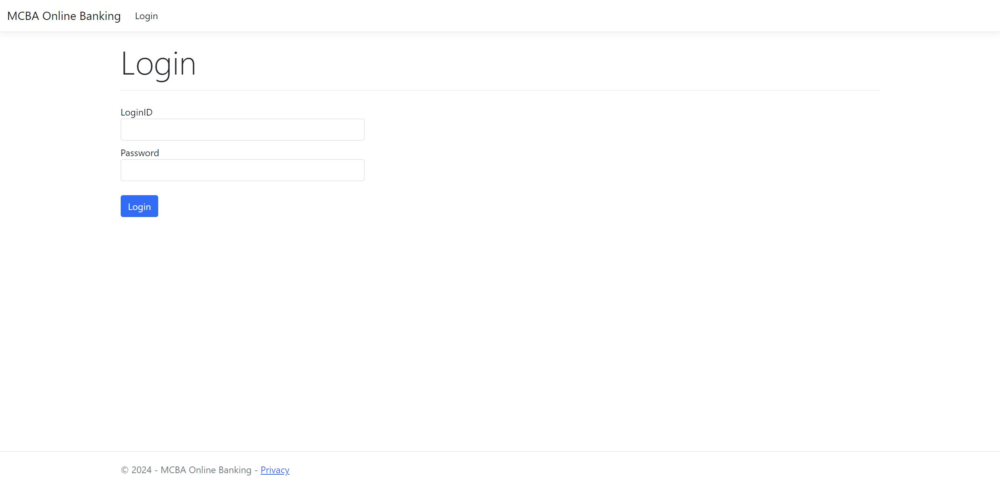
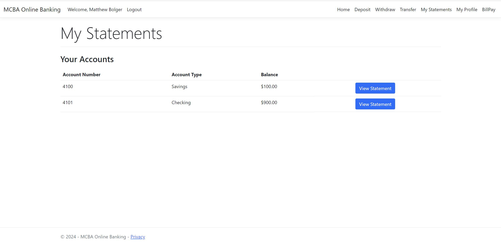
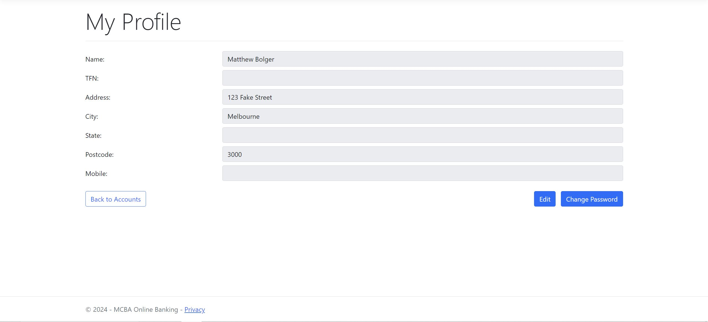
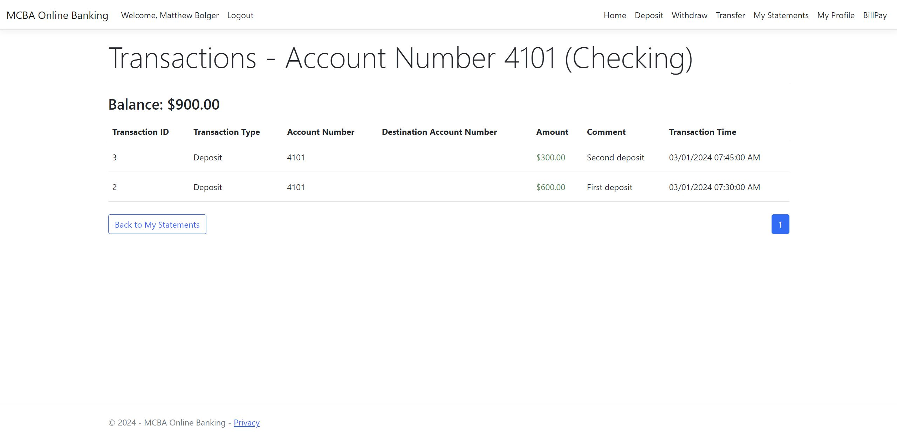

# .NET Banking Application

### Description

This project aims to demonstrate the capabilities of the .NET Framework and EF core. 
Utilising Bootstrap for the front-end and Azure SQL Server for the back-end, 
to create a functional full stack website. 

### Key Features
#### User Authentication and Authorization

- User authorisation to ensure secure access to banking details
- Password data is hashed and stored in the database 
#### Deposit, Withdraw and Transfer

-	Logged in users can Withdraw, Deposit and Transfer funds from different accounts. 
-	Server-Side validation to ensure correct data is processed
#### Edit Profile Details

- Profile details can be updated
- Changes will affect the database
#### Transaction History

-	All transactions are stored the database
-	Users have a paged list to view all transactions
